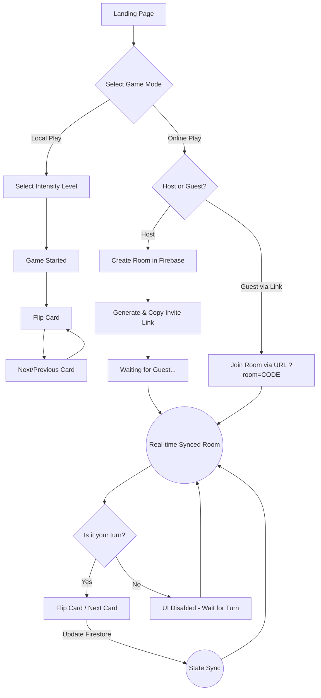
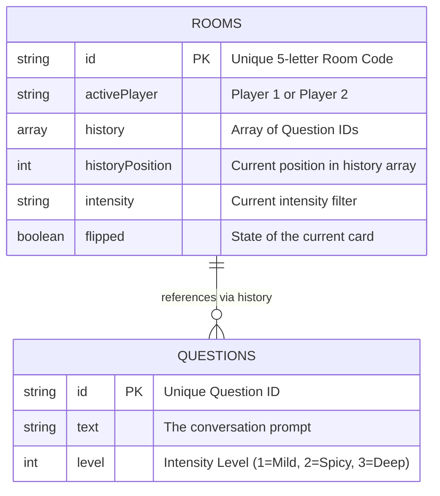

# Between Us — Product Requirements & Design Document (PRD)

## 1. Product Overview
**Between Us** is an aesthetic, interactive web application designed to foster deep, meaningful conversations between friends, partners, or strangers. Users draw prompt cards ranging from light-hearted to deeply emotional. The application supports both **Local Play** (pass-and-play on a single device) and **Online Multiplayer** (real-time synchronized gameplay across multiple devices).

---

## 2. User Flow & Game Logic Diagram
The following diagram illustrates the player journey, from landing on the application to interacting with the game modes.

---

## 3. System Architecture Diagram
The architecture leverages a modern React stack with a Serverless backend for real-time capabilities.

---

## 4. UI / UX Design System

The application relies on a **Dark Glassmorphism** aesthetic, designed to feel intimate, late-night, and distraction-free.

### Typography
To create a sophisticated and engaging reading experience, the application utilizes a dual-font system loaded via `next/font/google`:
*   **Primary Serif (Cormorant Garamond):** Used exclusively for the question cards. It feels elegant, poetic, and slows the reader down to digest the depth of the questions.
*   **Secondary Sans-Serif (Jost):** Used for all UI elements (buttons, menus, metadata). It is clean, geometric, and modern.

### Color Palette
*   **Background:** Deep, rich gradient transitions.
    *   `#0A0A0A` to `#1A0B2E` (Very Dark Violet/Black).
*   **Cards / Containers:** Glassmorphism layers.
    *   `rgba(255, 255, 255, 0.05)` with `backdrop-blur-md` and a subtle 1px white border (`rgba(255, 255, 255, 0.1)`).
*   **Text Colors:** 
    *   Main Body: `#E2E8F0` (Slate-200) for high readability without harsh contrast.
    *   Muted/Subtext: `#94A3B8` (Slate-400).
*   **Accents & Glows:** Soft purple glows (`#8B5CF6`) applied to buttons on hover and behind the main card to create depth.

### Core UI Components
1.  **Flip Card:** The centerpiece of the UI. Built with `framer-motion` using 3D `rotateY` transforms. It has a patterned/branded back and a minimalist front revealing the question.
2.  **Intensity Meter:** Represented by icons (e.g., 🌶️ for spicy, 🌊 for deep) embedded directly into the card UI to subtly indicate the weight of the question being asked.
3.  **Controls Bar:** Fixed/sticky bottom or floating controls containing "Back", "Flip", and "Next". Online mode dynamically applies `opacity-50 pointer-events-none` when it is not the local player's turn.

---

## 5. Core Features & Mechanics

*   **Intensity Filtering:** Questions are categorized. Players can choose a specific vibe (Mild, Spicy, Deep) or play on "Random" which pools all questions together.
*   **Turn-based Real-time Sync:** Powered by Firestore `onSnapshot`. Only the "Active" player can interact with the deck. Once they progress the game, the turn is securely handed over to the other player.
*   **Stable Game History:** Uses Unique Identifiers (`ID`s) rather than array indexes to maintain perfectly synchronized histories across devices, allowing players to navigate back and forth without desynchronization.
*   **Frictionless Invites:** A single "Invite" button generates a URL with a query parameter (e.g., `?room=A4X9P`) and copies it to the clipboard. The guest simply clicks the link to instantly connect.
*   **Responsive Layout:** Fully optimized for mobile screens (touch-friendly buttons, viewport-height aware layouts) while remaining elegant on desktop displays.
